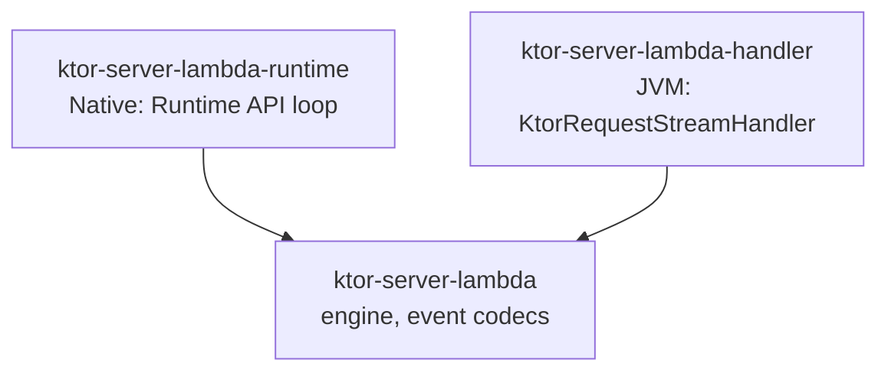

# ktor-server-lambda

A [Ktor](https://ktor.io) server engine for AWS Lambda. It runs your Ktor application once per Lambda invocation,
without opening a socket, on Kotlin/Native (`provided.al2023`) and on the JVM.

> Status: early development (`0.1.0`). APIs may change before 1.0.

## Supported event sources

| Source | Event format |
| --- | --- |
| API Gateway REST API (Lambda proxy integration) | payload 1.0 |
| API Gateway HTTP API | payload 1.0 and 2.0 |
| Lambda Function URL (`BUFFERED`) | payload 2.0 |
| Application Load Balancer | with and without multi-value headers |

Response streaming, VPC Lattice and WebSocket APIs are not supported yet.

## Modules

| Artifact | Platforms | Use it for |
| --- | --- | --- |
| `com.jsoizo:ktor-server-lambda-runtime` | linuxX64, linuxArm64 | Kotlin/Native on the `provided.al2023` custom runtime |
| `com.jsoizo:ktor-server-lambda-handler` | JVM | The managed `java21` / `java25` runtimes, with SnapStart priming |
| `com.jsoizo:ktor-server-lambda` | JVM, linuxX64, linuxArm64 | The engine alone, for passing event payloads to `handle(payload, invocation)` from your own loop |



Depend on just the one artifact you need; the modules below it come in transitively.

## Usage

Requires Kotlin 2.3 or later and Ktor 3.6 or later. The JVM artifacts run on Java 17 or later, except
`ktor-server-lambda-handler`, which targets the managed `java21` and `java25` runtimes.

### Releases

Releases are available from Maven Central. This Gradle Kotlin DSL example uses `0.1.0` for the managed Java runtime:

```kotlin
repositories {
    mavenCentral()
}

dependencies {
    implementation("com.jsoizo:ktor-server-lambda-handler:0.1.0")
}
```

For Kotlin/Native, add `com.jsoizo:ktor-server-lambda-runtime:0.1.0` to your native source set dependencies.

### Snapshots

Snapshot artifacts are published to the Central Portal snapshot repository. To use the current development
version, add that repository and depend on `0.1.0-SNAPSHOT`:

```kotlin
repositories {
    mavenCentral()
    maven("https://central.sonatype.com/repository/maven-snapshots/") {
        mavenContent { snapshotsOnly() }
    }
}

dependencies {
    implementation("com.jsoizo:ktor-server-lambda-handler:0.1.0-SNAPSHOT")
}
```

For Kotlin/Native, use `com.jsoizo:ktor-server-lambda-runtime:0.1.0-SNAPSHOT` in your native source set dependencies.
Use `--refresh-dependencies` to fetch a newly published snapshot. Alternatively, `./gradlew publishToMavenLocal`
installs the current source locally; add `mavenLocal()` to the consuming project's repositories to use it.

## Quick start

### Kotlin/Native

```kotlin
fun main() = lambdaMain {
    if (isRunningOnLambda()) {
        embeddedServer(AwsLambda) { module() }
    } else {
        embeddedServer(CIO, port = 8080) { module() }
    }
}

fun Application.module() {
    routing { get("/") { call.respondText("hello") } }
}
```

`lambdaMain` reports a failure during module initialization to the Runtime API before exiting. Locally the same
module runs on CIO; use `call.lambdaOrNull` in code that runs on both, since `call.lambda` throws off Lambda. The
runtime artifact targets Linux only, so on macOS keep `module()` in common code and run it from a JVM target with CIO.

For Kotlin/Native, name the executable `bootstrap` and link `libcrypt` statically, because the `provided.al2023`
environment has no `libcrypt.so.1`:

```kotlin
kotlin {
    linuxArm64 {
        binaries.executable {
            baseName = "bootstrap"
            linkerOpts("--as-needed", "-Bstatic", "-lcrypt", "-Bdynamic")
        }
    }
}
```

### Managed Java runtime

```kotlin
class Handler : KtorRequestStreamHandler({ module() }) {
    // Optional: requests sent through the pipeline before a SnapStart snapshot.
    override val primingRequests get() = listOf(PrimingRequest.get("/health"))
}
```

Set `Handler` as the function handler on `java21` or `java25`.

## Configuration

```kotlin
embeddedServer(AwsLambda, configure = {
    stripStage = true          // drop the stage segment from HTTP API paths on execute-api hosts
    stripBasePath = "/api"     // drop a custom domain base path
    concurrency = null         // workers; defaults to AWS_LAMBDA_MAX_CONCURRENCY or 1
    errorMode = ErrorMode.HttpResponse  // or LambdaError to report exceptions as Lambda errors
}) { module() }
```

Inside a route, `call.lambda` exposes the invocation (request id, deadline, trace id), the event source, the
`requestContext` (authorizer claims and the like) and the raw event.

## Things to know about Lambda

- **Error messages**: like every Ktor engine, an unhandled exception becomes a 500 whose body is the exception
  message. Install [StatusPages](https://ktor.io/docs/server-status-pages.html) to control what clients see. With
  `ErrorMode.LambdaError`, the message and stack trace go to the Lambda error report and logs instead.
- **Failures after the headers are sent** (an exception inside `respondBytesWriter`, a wrong `Content-Length`) are
  raised as invocation errors in every mode, where a socket-based engine would drop the connection.

- **Binary responses on REST APIs** need `binaryMediaTypes` on the API (for example `*/*`); otherwise clients
  receive the base64 text.
- **ALB** can only carry one value per header unless the target group enables
  `lambda.multi_value_headers.enabled`; without it only the last `Set-Cookie` is sent and a warning is logged.
- **Client address on ALB** comes from the last `X-Forwarded-For` entry. With the ALB's XFF mode set to `preserve`,
  clients control that value.
- **Background work**: coroutines launched with `call.launch` are cancelled once the response is built, because
  Lambda may freeze the environment right after it is sent.

## Samples and tests

| Sample | Shows |
| --- | --- |
| [`samples/native-hello`](samples/native-hello) | Kotlin/Native on `provided.al2023` (`./gradlew :native-hello:bootstrapZipLinuxArm64`) |
| [`samples/jvm-managed`](samples/jvm-managed) | Managed `java21` runtime (`./gradlew :jvm-managed:lambdaZip`) |

To build the JVM sample from the **published** snapshot instead of the modules in this checkout, run
`./gradlew :jvm-managed:lambdaZip -PusePublishedSnapshot --refresh-dependencies`. The ZIP then contains the
published handler and engine JARs. See [infra/README.md](infra/README.md) for the AWS deployment and
verification commands. The October 4, 2026 deployment in `ap-northeast-1` returned HTTP 200 for `/` and
`/echo/test?q=hello%20world` through REST API, HTTP API payload 1.0/2.0, and Function URL; the published Lambda
version reported SnapStart `OptimizationStatus: On`. Resources were left running for manual inspection; the local,
git-ignored `.work/deployment-resources.md` records their identifiers and URLs.

`./gradlew check` runs unit tests, ktlint, detekt, ABI checks and verifies that native binaries only need libraries
present on `provided.al2023`. The Kotlin/Native unit tests run inside the `provided.al2023` image for the host's
architecture, so `check` needs Docker. `./gradlew :integration-test:integrationTest` builds a test app for Kotlin/Native
and for the managed Java runtime and runs the use cases every release must keep working (each event format, cookies,
binary and large bodies, application errors, warm invocations) in the official Lambda base images with the Runtime
Interface Emulator, through Testcontainers (Docker required).

## License

[MIT](LICENSE)
